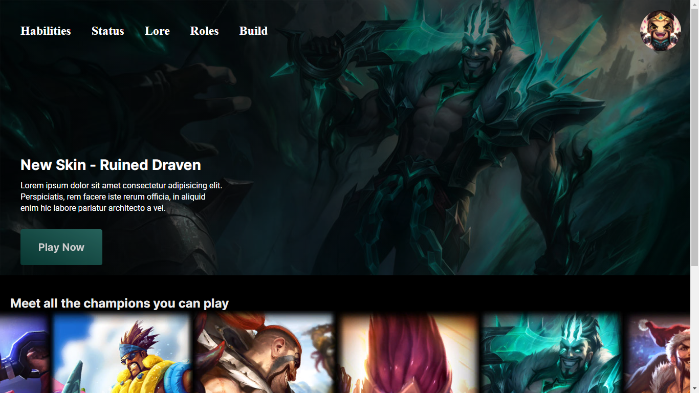

<!-- # league-of-draven -->
<h1 align="center">Welcome to the League of Draven</h1>

<p align="center">
Welcome to the league of draven! UI Web page that provides information about the best league of legends champion.
</p>


 
<p align="center"> 
 <a href="#Tecnologies">Tecnologies</a> • 
 <a href="#Run the Project">Run the Project</a> • 
 <a href="#New Features">New Features</a> • 
 <a href="#References">References</a> • 
 <a href="#Author">Author</a>
</p>

# Tecnologies
* HTML
* CSS
* Javascript

# Run the Project
<p>
 Download or clone the project

  ```
  https://github.com/Lucas-Lameira/league-of-draven.git
  ```
Open the file **index.html** in the browser
</p>

<h1 align="center">
  
</h1>


## New Features
- [ ] Add lore
- [ ] Add habilities
- [ ] Add status
- [ ] Add builds
- [ ] Add Roles

<!-- Estatus do projeto -->
#### 🚧 This project is not finished 🚧
## References
https://github.com/florentmolle/slider-touch/tree/main/slider


## Author
@Lucas de Souza Lameira
